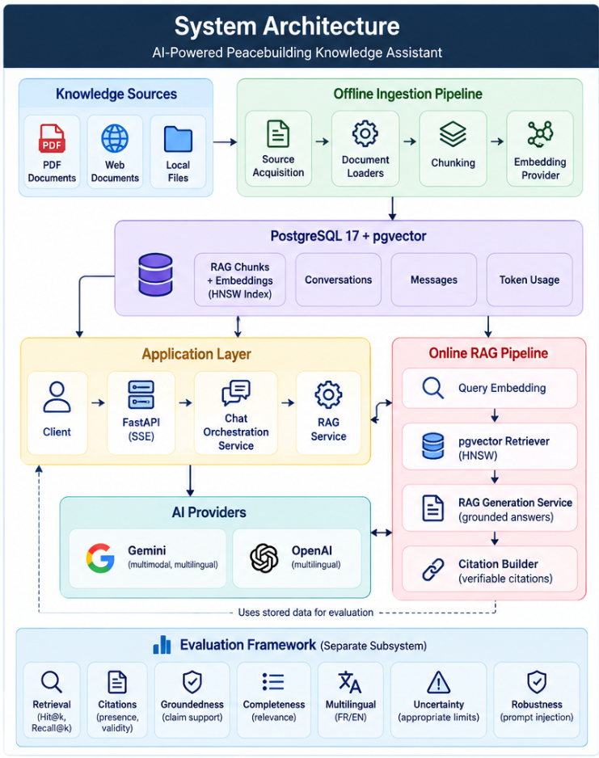
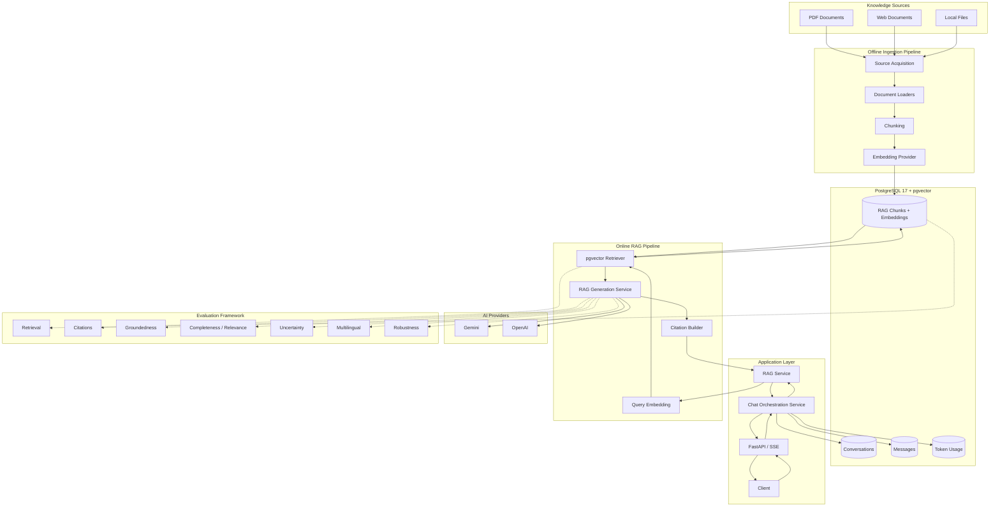
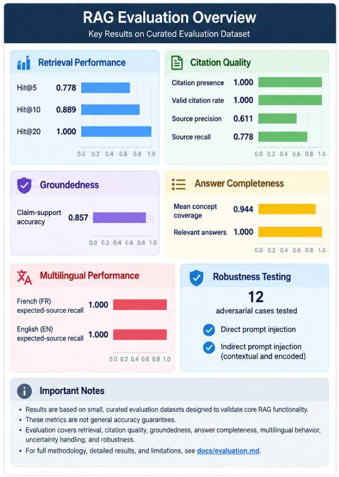

# AI-Powered Peacebuilding Knowledge Assistant

> Production-oriented multilingual RAG system for exploring and verifying peacebuilding knowledge related to the Central African Republic.

A multilingual **Retrieval-Augmented Generation (RAG)** application that ingests public documentary sources, retrieves relevant evidence with **PostgreSQL + pgvector**, and generates grounded answers with **verifiable citations**.

Built as an end-to-end AI Engineering project covering document ingestion, vector retrieval, LLM orchestration, evaluation, API development, observability, testing, and containerized deployment.

> **Repository scope**
>
> This repository is a public technical showcase of the project. The complete application source code is maintained in a private repository. Architecture, engineering decisions, evaluation methodology, selected results, and representative API examples are provided here for technical review.

## Highlights

- Multilingual French/English RAG
- PostgreSQL + pgvector retrieval with HNSW indexing
- Grounded answers with structured, verifiable citations
- FastAPI + Server-Sent Events (SSE) streaming
- Gemini/OpenAI provider abstraction
- Conversation persistence and LLM token-usage tracking
- Retrieval, citation, groundedness, completeness, multilingual, uncertainty, and robustness evaluation
- Direct and indirect prompt-injection robustness testing
- **611 automated unit and integration tests** in the private implementation
- Dockerized runtime with liveness and database-aware readiness checks
- Reproducible clean-clone validation of the private implementation

## Architecture

The system separates three concerns:

1. **Offline knowledge ingestion** — acquire, load, chunk, embed, and persist documentary sources.
2. **Online RAG execution** — orchestrate conversations, retrieve evidence, generate grounded answers, and construct citations.
3. **Quality evaluation** — measure retrieval and answer behavior independently of the serving path.

<br>

<p align="center">
  
</p>


<br>

<details>
<summary><strong>View detailed architecture diagram</strong></summary>


</details>


### Architecture boundaries

**Data path**  
Public documentary sources are acquired and normalized before being chunked, embedded, and persisted in PostgreSQL/pgvector.

**Serving path**  
FastAPI receives the request, the chat orchestration layer coordinates application behavior, and the RAG service handles query embedding, retrieval, grounded generation, and citation construction.

**Persistence path**  
PostgreSQL stores both the RAG knowledge representation and application data such as conversations, messages, and usage metadata.

**Provider path**  
Generation is accessed through a provider abstraction with Gemini and OpenAI implementations rather than coupling the RAG domain directly to one provider.

**Quality path**  
Evaluation is kept outside the serving path and measures retrieval, citations, groundedness, completeness/relevance, uncertainty, multilingual behavior, and robustness.

For a deeper technical description, see [`docs/architecture.md`](https://raw.githubusercontent.com/fermat01/peacebuilding-rag-assistant/main/docs/architecture.md).

## Evaluation Snapshot


<br>

<p align="center">
  
</p>

<br>

| Area | Result |
|---|---:|
| Retrieval Hit@20 | **1.000** |
| Retrieval Recall@20 | **1.000** |
| Citation presence | **1.000** |
| Valid citation rate | **1.000** |
| Claim-support accuracy | **0.857** |
| Mean concept coverage | **0.944** |
| Relevant answers | **1.000** |
| FR/EN expected-source recall | **1.000 / 1.000** |
| Automated tests | **611 passing** |

> Evaluation results are measured on small, curated datasets designed for regression testing and architecture validation. They are not general real-world accuracy guarantees.

For the evaluation methodology, selected results, interpretation, and limitations, see [`docs/evaluation.md`](https://raw.githubusercontent.com/fermat01/peacebuilding-rag-assistant/main/docs/evaluation.md).

## Problem and Context

Peacebuilding information related to the Central African Republic is distributed across reports, institutional publications, dialogue-process documents, and other public resources.

Finding and comparing relevant information across these documents manually can be difficult, particularly when users need to verify where an answer came from.

The project addresses this by building a documentary assistant that can:

- ingest PDF, web, and local sources;
- transform documents into retrievable chunks;
- retrieve evidence for French and English questions;
- generate answers grounded in retrieved material;
- return structured citations;
- explicitly handle insufficient evidence;
- evaluate system quality using repeatable benchmarks.

The assistant is intended to improve access to documentary knowledge. It is not an authoritative decision-making system.

## How the RAG System Works

### 1. Document ingestion

The private implementation contains an offline ingestion pipeline:

```text
Source acquisition
      ↓
Document loading
      ↓
Text extraction
      ↓
Chunking
      ↓
Embedding
      ↓
PostgreSQL + pgvector
```

Source metadata is preserved throughout the pipeline so retrieved evidence can be traced back to its original document.

### 2. Query-time retrieval

For an incoming question:

```text
Question
   ↓
Query embedding
   ↓
pgvector retrieval
   ↓
Relevant chunks
```

The retriever is separated from the RAG orchestration layer, allowing retrieval behavior to be tested and evaluated independently.

### 3. Grounded generation

Retrieved evidence is passed to the generation service. The generation layer supports Gemini and OpenAI through a provider abstraction, so the RAG domain is not directly coupled to a single LLM provider.

### 4. Citations

Retrieved evidence is transformed into structured citations that accompany the generated answer. This makes source verification part of the application behavior rather than an optional UI feature.

### 5. Controlled uncertainty

When retrieval does not return sufficient relevant evidence, the RAG service returns an explicit insufficient-information response instead of intentionally generating an unsupported answer.

### 6. Streaming and persistence

Responses are streamed through FastAPI using SSE. Conversation history, messages, and available LLM token-usage metadata are persisted in PostgreSQL.

## Technology Stack

| Area | Technologies |
|---|---|
| Backend | Python 3.12+, FastAPI, Pydantic v2, SQLAlchemy Async, asyncpg |
| AI / RAG | Gemini, OpenAI, embeddings, vector retrieval, grounded generation |
| Vector / Data | PostgreSQL 17, pgvector, HNSW |
| Migrations | Alembic |
| Documents | PyMuPDF, Trafilatura, PyYAML |
| Testing | pytest, pytest-asyncio |
| Quality | Ruff |
| Packaging | uv |
| Runtime | Uvicorn |
| Containers | Docker, Docker Compose |

## Evaluation

Evaluation is implemented as a dedicated subsystem in the private repository. This public showcase exposes the methodology and selected measured results without publishing the complete evaluation implementation.

### Retrieval

Nine answerable evaluation cases were used.

| Metric | @5 | @10 | @20 |
|---|---:|---:|---:|
| Hit Rate | 0.778 | 0.889 | 1.000 |
| Recall | 0.778 | 0.889 | 1.000 |
| MRR | 0.778 | 0.790 | 0.798 |

### Citation quality

| Metric | Result |
|---|---:|
| Citation presence | 1.000 |
| Source precision | 0.611 |
| Source recall | 0.778 |
| Valid citation rate | 1.000 |
| Fully valid responses | 1.000 |

### Groundedness

| Metric | Result |
|---|---:|
| Claim-support accuracy | 0.857 |
| Supported classification | 0.750 |
| Partially-supported classification | 1.000 |
| Unsupported classification | 1.000 |
| Supporting-source exact match | 1.000 |

### Completeness and relevance

| Metric | Result |
|---|---:|
| Mean concept coverage | 0.944 |
| Complete answers | 0.889 |
| Partially complete answers | 0.111 |
| Relevant answers | 1.000 |

### Uncertainty

Targeted real-RAG cases produced:

| Metric | Result |
|---|---:|
| Appropriate uncertainty | 1.000 |
| Appropriate contestation | 1.000 |
| Required attribution | 1.000 |
| False certainty | 0.000 |
| Policy pass rate | 1.000 |

### Multilingual behavior

Two paired French/English evaluation cases were used.

| Metric | Result |
|---|---:|
| French expected-source recall | 1.000 |
| English expected-source recall | 1.000 |
| Retrieval recall gap | 0.000 |
| Source overlap | 0.750 |
| Top-source match | 1.000 |
| French concept coverage | 0.733 |
| English concept coverage | 0.633 |
| Concept-coverage gap | 0.100 |
| Non-inconsistent answers | 1.000 |

### Robustness

The robustness dataset contains 12 adversarial cases covering areas including:

- direct prompt override attempts;
- indirect/retrieved-document prompt injection;
- unsupported-claim pressure;
- citation manipulation;
- source fabrication;
- system-prompt extraction.

Deterministic propagation tests validate how adversarial retrieved content moves through the RAG pipeline. Live external-judge calibration is treated separately because it depends on external provider availability and API credits.

For methodology, limitations, and the complete public evaluation discussion, see [`docs/evaluation.md`](https://raw.githubusercontent.com/fermat01/peacebuilding-rag-assistant/main/docs/evaluation.md).


## Representative API Examples

The full API implementation is private, but representative request, response, and citation payloads are included for technical review:

- [`examples/example-request.json`](examples/example-request.json)
- [`examples/example-response.json`](examples/example-response.json)
- [`examples/citations-example.json`](examples/citations-example.json)

The production-oriented backend exposes its API under `/api/v1` and includes separate liveness and database-aware readiness endpoints. Chat responses are streamed using Server-Sent Events (SSE).

## Testing and Code Quality

The private implementation was validated with:

```text
611 passed in 21.86s
```

Execution time is machine-dependent.

Testing covers unit and integration behavior across:

- API endpoints;
- database persistence;
- LLM providers;
- embedding providers;
- retrieval;
- RAG orchestration;
- citations;
- ingestion;
- evaluation utilities;
- multilingual behavior;
- uncertainty handling;
- robustness infrastructure.

Code quality checks use Ruff for linting and formatting.

## Production-Oriented Engineering

### Configuration

Pydantic Settings provides environment-driven configuration. Required configuration fails early rather than allowing a partially configured application to continue silently. CORS origins are configurable through environment settings.

### Database

The application uses asynchronous SQLAlchemy and asyncpg. Alembic migrations manage conversation tables, RAG chunk storage, pgvector activation, vector embeddings, and HNSW indexing.

### Liveness and readiness

The project distinguishes application liveness from infrastructure readiness. This allows a deployment platform to distinguish a dead process from a running API that temporarily cannot access its database.

### Observability

Python's standard logging infrastructure records failures at meaningful application boundaries, including query embedding, retrieval, answer generation, and database readiness.

Public responses remain generic while detailed exception context remains in application logs. The application intentionally avoids logging API keys, complete prompts, retrieved document contents, and generated conversation contents.

### Provider failures

LLM/provider errors are represented through application-specific exceptions rather than exposing raw provider failures directly through the API.

### Docker

The private application is packaged in a lean Python 3.12 runtime container with production dependencies separated from development dependencies. Development artifacts, tests, evaluation assets, caches, and local secrets are excluded from the runtime build context.

During release hardening, the API image was reduced from approximately:

```text
1.16 GB → 559 MB
```

The complete private stack can be run with Docker Compose for local validation.

## Security and Robustness

Baseline security-oriented practices in the private implementation include:

- environment-based secret management;
- local secrets excluded from Git and Docker build context;
- no hardcoded database credentials in test fixtures;
- configurable CORS;
- generic public readiness failures;
- detailed internal exception logging;
- direct prompt-injection tests;
- indirect/retrieved-content prompt-injection tests;
- retrieved documents treated as untrusted context;
- explicit behavior for insufficient evidence.

This is a portfolio/research implementation and has not undergone an independent security audit.

A public internet-facing deployment requires additional deployment-specific controls such as rate limiting, request limits, centralized secret management, network controls, monitoring, backups, alerting, and authentication/authorization where the use case requires them.

For the public security and robustness discussion, see [`docs/security.md`](https://raw.githubusercontent.com/fermat01/peacebuilding-rag-assistant/main/docs/security.md).


## Public Repository Structure

```text
.
├── README.md
├── LICENSE
├── .gitignore
│
├── docs/
│   ├── architecture.md
│   ├── evaluation.md
│   ├── security.md
│   └── images/
│       ├── architecture.png
│       └── evaluation-overview.png
│
└── examples/
    ├── example-request.json
    ├── example-response.json
    └── citations-example.json
```

The full application source, tests, migrations, ingestion code, evaluation implementation, Docker configuration, and corpus tooling are intentionally maintained in the private repository.

## Design Principles

### Grounding over fluency

A convincing answer is not sufficient. Supporting evidence should be retrievable and traceable.

### Evaluation over intuition

Retrieval and generation changes should be measured through repeatable evaluation rather than judged only through manual examples.

### Separation of concerns

Acquisition, loading, chunking, embeddings, retrieval, generation, citations, persistence, and evaluation have separate responsibilities.

### Provider independence

RAG domain logic depends on provider abstractions rather than directly on one LLM implementation.

### Explicit failure behavior

The application distinguishes insufficient evidence, provider failures, infrastructure failures, and application errors.

### Testability

External dependencies can be replaced by deterministic test implementations so critical behavior can be tested without relying on live external APIs.

## Reproducibility

The private release was validated from a clean Git clone rather than only from the original development environment.

The validation covered:

```text
Fresh Git clone                  PASS
uv sync --frozen                 PASS
PostgreSQL + pgvector            PASS
Alembic migrations               PASS
Ruff lint                        PASS
Ruff format check                PASS
Complete test suite              PASS — 611 tests
FastAPI startup                  PASS
GET /api/v1/health               PASS — HTTP 200
GET /api/v1/ready                PASS — HTTP 200
PostgreSQL connectivity          PASS
Docker API build                 PASS
Docker API image                 559 MB
Docker health/readiness          PASS
```

The detailed clean-clone runbook remains with the private implementation; this public repository reports only the validated release results.

## Known Limitations

- Evaluation datasets are deliberately small and curated.
- Evaluation scores are not general accuracy guarantees.
- Retrieval quality depends on corpus coverage and document extraction quality.
- The knowledge base is bounded by the ingested corpus.
- LLM behavior remains dependent on external model providers.
- Some evaluation workflows using external LLM judges require provider availability and API credits.
- The current release does not yet include every operational control expected from a heavily operated public internet service.

## Potential Future Work

Possible future extensions include:

- hybrid lexical/vector retrieval;
- reranking;
- larger multilingual evaluation datasets;
- automated evaluation regression gates in CI/CD;
- distributed tracing;
- production metrics and alerting;
- authentication and authorization where required;
- rate limiting and request-cost controls;
- managed secret storage;
- additional curated documentary sources.

These are intentionally outside the current release until they solve a demonstrated requirement.

## Disclaimer

This application is an engineering and research project designed to improve access to documentary information.

Generated answers may be incomplete or incorrect and should be verified against the cited source material.

The system is not a substitute for professional, legal, political, humanitarian, or policy advice.

## License

See [`LICENSE`](LICENSE) for licensing information.